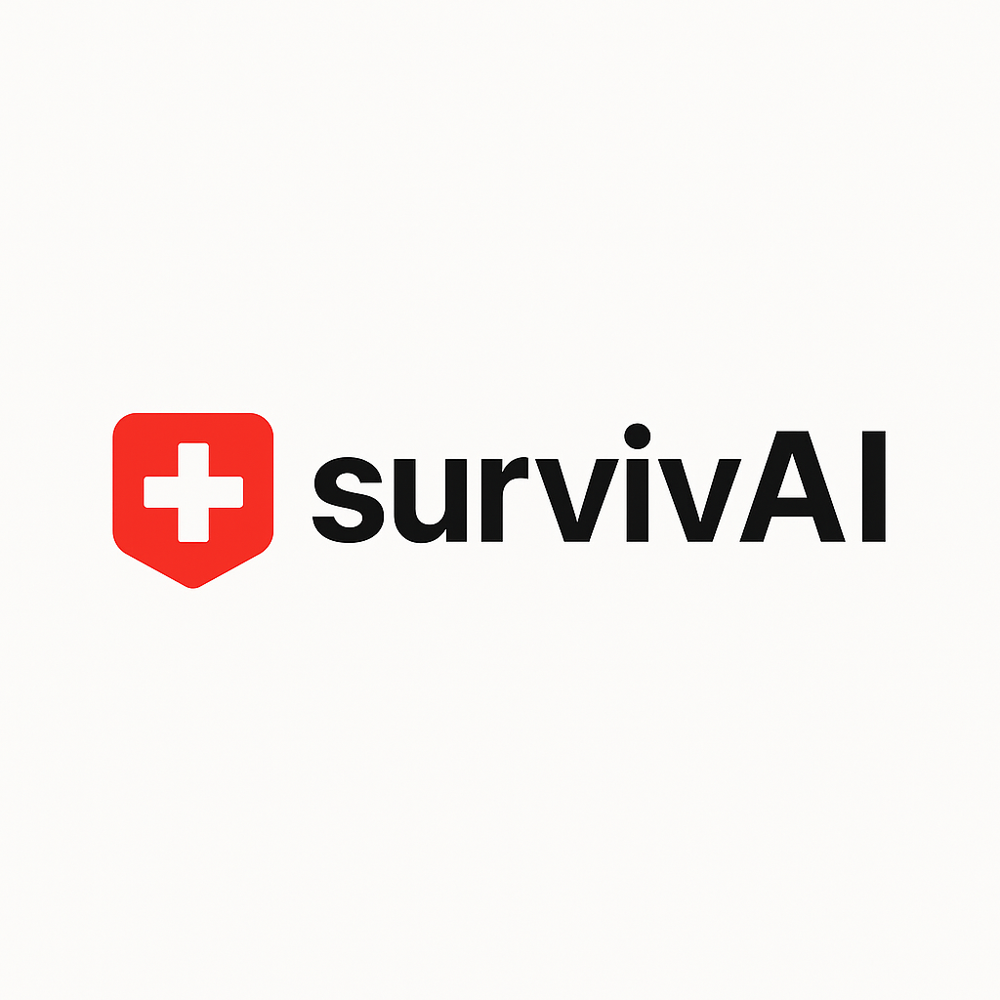

<div align="center">
  
  
  # survivAI
  
  **survivAI** is a native iOS/macOS emergency survival assistant app with RAG (Retrieval-Augmented Generation) and semantic memory capabilities. It provides local AI assistance using the llama.cpp inference engine, running entirely on-device without requiring internet connectivity or external API calls—making it ideal for emergency situations where network access may be unavailable.
</div>

## Overview

survivAI is designed as an emergency survival companion that provides critical, actionable advice in survival situations. The app combines a large language model with a curated knowledge base and semantic memory to deliver context-aware, intelligent responses. Key features include:

- **RAG-Enhanced Responses**: Retrieves relevant survival knowledge from a pre-built database to augment AI responses
- **Semantic Memory**: Automatically extracts and remembers key facts from conversations (location, conditions, resources, etc.)
- **Fully Offline Operation**: All AI processing, database queries, and memory management happen on-device
- **Emergency-Focused**: Specialized knowledge base covering natural disasters, outdoor emergencies, medical situations, and more
- **Context-Aware**: Maintains conversation history and semantic facts to provide personalized advice
- **Privacy-First**: No data leaves your device—all knowledge, memories, and conversations stay local

## Key Features

### 🧠 Intelligence & Knowledge
- ✅ **RAG (Retrieval-Augmented Generation)**: Searches curated emergency knowledge base for relevant information
- ✅ **Semantic Memory System**: Automatically extracts and stores key facts from conversations
- ✅ **Vector Database**: Pre-computed embeddings for fast knowledge retrieval
- ✅ **Category Detection**: Automatically categorizes emergencies (natural disaster, medical, outdoor, etc.)
- ✅ **Context-Aware Responses**: Combines knowledge base, memories, and conversation history

### 🚀 Performance & Privacy
- ✅ **100% Offline Operation**: No internet required—LLM inference, database queries, and memory all on-device
- ✅ **Metal GPU Acceleration**: Optimized for Apple Silicon with full GPU offloading
- ✅ **Session Management**: Automatic session handling with 48-hour expiry
- ✅ **Privacy-First Architecture**: All data stays local, no telemetry or cloud sync

### 💻 Technical Features
- ✅ **Phi-3.5 Mini Instruct Model**: Uncensored variant for direct emergency advice
- ✅ **SQLite Vector Database**: FTS5 full-text search with embedding support
- ✅ **Conversation History**: Token-aware truncation for optimal context management
- ✅ **Modern SwiftUI Interface**: Clean, responsive UI with typing effects
- ✅ **Cross-Platform Support**: iOS, macOS, tvOS, visionOS

## Setup Requirements

### 1. Model Setup (Required)

**The app requires a GGUF model file to function.** The model files are not included in the repository due to their large size (2.2GB+).

### Download the Model

1. Visit the Hugging Face repository: [bartowski/Phi-3.5-mini-instruct_Uncensored-GGUF](https://huggingface.co/bartowski/Phi-3.5-mini-instruct_Uncensored-GGUF/tree/main)

2. Download the recommended quantization:
   - **Phi-3.5-mini-instruct_Uncensored-Q4_K_M.gguf** (2.39 GB) - Best balance of quality and size

   Other quantization options available:
   - `Q2_K.gguf` (1.42 GB) - Smallest, lower quality
   - `Q4_K_S.gguf` (2.19 GB) - Smaller, slightly lower quality
   - `Q5_K_M.gguf` (2.82 GB) - Higher quality, larger size
   - `Q8_0.gguf` (4.06 GB) - Near-original quality, large size

3. Place the downloaded `.gguf` file in:
   ```
   survivAI/Models/Phi-3.5-mini-instruct_Uncensored-Q4_K_M.gguf
   ```

4. Add the file to your Xcode project:
   - Drag the file into the Xcode project navigator
   - Ensure "Copy items if needed" is checked
   - Select the `survivAI` target
   - Verify it appears in Build Phases → Copy Bundle Resources

#### Why This Model?

The **Phi-3.5-mini-instruct_Uncensored** model was chosen for several reasons:
- **Compact Size**: Optimized for mobile devices (2.2GB at Q4_K_M quantization)
- **High Quality**: Based on Microsoft's Phi-3.5, trained for instruction-following
- **Uncensored Variant**: Provides direct, unfiltered emergency advice without safety limitations
- **Fast Inference**: Runs efficiently on iPhone 16 Pro with Metal acceleration

### 2. Knowledge Database Setup (Automatic)

The app includes a **pre-built emergency knowledge database** that is automatically generated during the build process:

- **Location**: `survivAI/Resources/emergency_knowledge.db`
- **Auto-Generation**: The database is regenerated automatically if JSON knowledge files are updated
- **Build Phase Script**: `Scripts/build_phase_regenerate_db.sh` handles automatic regeneration
- **Manual Generation**: Run `python3 Scripts/generate_embeddings.py` to regenerate manually

#### Knowledge Database Contents
- Curated emergency survival scenarios across multiple categories
- Pre-computed sentence embeddings (all-MiniLM-L6-v2 model)
- FTS5 full-text search index for fast keyword matching
- Hybrid search combining keywords and semantic similarity

#### Python Dependencies (for database regeneration)
If you need to modify the knowledge base, install Python dependencies:
```bash
cd Scripts
pip install -r requirements.txt
```

Required packages:
- `sentence-transformers==2.2.2` - For generating embeddings
- `torch==2.1.0` - PyTorch backend
- `numpy==1.24.3` - Numerical operations

## Project Structure

```
survivAI/
├── survivAI/
│   ├── survivAIApp.swift              # App entry point
│   ├── ContentView.swift              # Main chat UI (legacy)
│   ├── LLMWrapper.h/.mm               # Objective-C++ llama.cpp wrapper
│   ├── Models.swift                   # Data models for conversations
│   ├── Models/                        # GGUF model files (gitignored)
│   │   └── .gitkeep                   # Directory marker with instructions
│   ├── Services/
│   │   ├── LLMService.swift           # LLM service layer
│   │   ├── RAGService.swift           # RAG coordination layer (NEW)
│   │   ├── VectorDBService.swift      # Knowledge base retrieval (NEW)
│   │   ├── MemoryService.swift        # Semantic memory management (NEW)
│   │   └── TextProcessingService.swift # Text processing utilities
│   ├── ViewModels/
│   │   └── ChatViewModel.swift        # Chat state management
│   ├── Views/
│   │   ├── ChatView.swift             # Main chat interface
│   │   ├── ChatBubble.swift           # Message bubble component
│   │   ├── MessageView.swift          # Message display with RAG context
│   │   ├── TypingIndicator.swift     # Loading animation
│   │   ├── TypingEffect.swift         # Text animation effect
│   │   ├── EmergencyQuickButton.swift # Quick action buttons
│   │   └── AppHeader.swift            # App header component
│   ├── Resources/                     # Data resources (NEW)
│   │   ├── emergency_knowledge.db     # Pre-built knowledge database
│   │   └── EmergencyKnowledge/        # JSON knowledge source files
│   ├── Extensions/
│   │   └── String+Extensions.swift    # String utilities
│   ├── Assets.xcassets/               # App icons and visual assets
│   ├── llama.xcframework/             # llama.cpp framework
│   ├── survivAI-Bridging-Header.h     # Swift/Objective-C bridging
│   ├── survivAI.entitlements          # App capabilities
│   └── Project.swift                  # Project configuration
├── Scripts/                           # Build automation (NEW)
│   ├── generate_embeddings.py         # Full embedding generation
│   ├── generate_embeddings_basic.py   # Lightweight version (no ML)
│   ├── build_phase_regenerate_db.sh   # Xcode build phase script
│   ├── run_embeddings.sh              # Manual generation script
│   └── requirements.txt               # Python dependencies
├── survivAI.xcodeproj/                # Xcode project
├── .gitignore                         # Git ignore rules
└── README.md                          # This file
```

## Architecture

### System Overview

survivAI uses a **three-layer architecture** combining RAG (Retrieval-Augmented Generation) with semantic memory:

```
┌─────────────────────────────────────────────────────────────┐
│                        User Interface                       │
│              (SwiftUI Views + ViewModel)                    │
└────────────────────────┬────────────────────────────────────┘
                         │
┌────────────────────────▼────────────────────────────────────┐
│                    RAG Service Layer                        │
│  • Combines Knowledge Base + Semantic Memory + LLM         │
│  • Builds context-aware system prompts                     │
│  • Category detection and routing                          │
└─────────┬───────────────────────────────┬───────────────────┘
          │                               │
┌─────────▼──────────────┐   ┌───────────▼───────────────────┐
│  VectorDBService       │   │   MemoryService               │
│  • Knowledge retrieval │   │   • Conversation storage      │
│  • Hybrid search       │   │   • Semantic fact extraction │
│  • FTS5 + embeddings   │   │   • Session management        │
└────────────────────────┘   └───────────────────────────────┘
          │                               │
┌─────────▼──────────────┐   ┌───────────▼───────────────────┐
│ emergency_knowledge.db │   │   semantic_memory.db          │
│ • Pre-built knowledge  │   │   • Conversations             │
│ • Category-organized   │   │   • Extracted facts           │
│ • Vector embeddings    │   │   • Session data              │
└────────────────────────┘   └───────────────────────────────┘
```

### Core Components

#### RAG Layer (NEW)
- **RAGService.swift**: Orchestrates knowledge retrieval and memory integration
  - Detects emergency category from user query
  - Retrieves relevant knowledge chunks from vector database
  - Fetches relevant semantic memories from conversation history
  - Builds enriched system prompts combining all context sources
  - Manages token budget for context inclusion

#### Knowledge Base Layer (NEW)
- **VectorDBService.swift**: Vector database operations for knowledge retrieval
  - Hybrid search combining FTS5 full-text and semantic similarity
  - Category-filtered queries for targeted knowledge
  - Pre-computed embeddings (all-MiniLM-L6-v2 model, 384 dimensions)
  - Priority-weighted ranking for critical information

#### Semantic Memory Layer (NEW)
- **MemoryService.swift**: Conversation memory and fact extraction
  - Automatic semantic fact extraction using pattern matching
  - Extracts: location, condition, resource, environment, temporal facts
  - Session-based memory management with auto-expiry (48 hours)
  - Importance-weighted retrieval for relevant context
  - Conversation history storage for continuity

#### LLM Layer
- **LLMWrapper.mm**: Objective-C++ wrapper around llama.cpp C API
  - Model loading and initialization
  - Token management and context window handling
  - Prompt building with RAG-enhanced system prompts
  - Generation with streaming support
  - Metal GPU acceleration configuration

#### Service Layer
- **LLMService.swift**: High-level Swift interface for LLM operations
- **TextProcessingService.swift**: Text cleanup and formatting utilities

#### View Layer (MVVM)
- **ChatViewModel.swift**: Manages chat state, message history, and coordinates RAG pipeline
- **ChatView.swift**: Main SwiftUI view for the chat interface
- **MessageView.swift**: Message display with RAG context indicators
- **ChatBubble.swift**: Message bubble component with user/assistant styling
- **TypingEffect.swift**: Animated text reveal for AI responses

### Technical Implementation Details

#### LLM Configuration
```objective-c
// Optimized for iPhone 16 Pro (A18 Pro)
model_params.n_gpu_layers = 40;  // Full GPU offloading
ctx_params.n_ctx = 4096;         // 4K context window
ctx_params.n_batch = 512;        // Batch size for processing
ctx_params.n_threads = 6;        // Performance core utilization
```

#### Sampling Strategy
- **Top-p (nucleus) sampling**: 0.75 for balanced creativity
- **Top-k sampling**: 15 for focused responses
- **Temperature**: 0.4 for deterministic, factual outputs
- **Mirostat v2**: Dynamic perplexity control for coherent text

#### Conversation Management
- Token-aware history truncation (maintains 90% context limit)
- Chronological history building (newest to oldest)
- Automatic summarization detection
- Bullet-point validation before history addition

#### Emergency Response Format
All responses follow this structure:
```
• ACTION IN CAPS - Brief explanation
• ACTION IN CAPS - Brief explanation
• ACTION IN CAPS - Brief explanation
• ACTION IN CAPS - Brief explanation
• ACTION IN CAPS - Brief explanation
```

### Platform Support

The included `llama.xcframework` supports:
- **iOS**: arm64 (device) + arm64/x86_64 (simulator)
- **macOS**: arm64 (Apple Silicon) + x86_64 (Intel)
- **tvOS**: arm64 (device) + arm64/x86_64 (simulator)
- **visionOS**: arm64 (device) + arm64/x86_64 (simulator)

## Building and Running

### Requirements
- Xcode 15.0 or later
- iOS 17.0+ / macOS 14.0+ / tvOS 17.0+ / visionOS 1.0+
- GGUF model file (see Model Setup above)

### Build Steps
1. Clone the repository
2. Download and add the GGUF model to `survivAI/Models/`
3. Open `survivAI.xcodeproj` in Xcode
4. Select your target device (recommended: iPhone 16 Pro or later)
5. Build and run (⌘R)

### Troubleshooting

**Model not found error:**
- Verify the model file is in `survivAI/Models/`
- Check the file is added to the Xcode target
- Ensure the filename matches exactly: `Phi-3.5-mini-instruct_Uncensored-Q4_K_M.gguf`

**Slow performance:**
- Ensure you're running on a physical device (not simulator)
- Check Metal GPU acceleration is enabled
- Try a smaller quantization (Q2_K or Q3_K)

**App crashes on launch:**
- Check available device memory (model requires ~3GB RAM)
- Verify llama.xcframework is properly linked
- Check Xcode console for specific error messages

## Development

### Created By
Muhammad Syafrizal (03/05/25)

### Architecture Pattern
- **MVVM**: Model-View-ViewModel architecture
- **SwiftUI**: Declarative UI framework
- **Combine**: Reactive programming for state management

### Key Technologies
- **llama.cpp**: Fast, efficient LLM inference engine
- **Metal**: Apple's GPU acceleration framework
- **GGUF**: Quantized model format for efficient storage
- **Objective-C++ Bridge**: Seamless C++/Swift integration

### Git Workflow
- GGUF model files are gitignored (too large for version control)
- Standard Swift `.gitignore` patterns applied
- Use `.gitkeep` to preserve empty `Models/` directory structure

## Performance Optimization

The app is optimized for iPhone 16 Pro but runs on older devices:

| Device | Model | Performance |
|--------|-------|-------------|
| iPhone 16 Pro | Q4_K_M | Excellent (~10 tokens/sec) |
| iPhone 15 Pro | Q4_K_M | Good (~7 tokens/sec) |
| iPhone 14 Pro | Q4_K_M | Fair (~5 tokens/sec) |
| iPhone 13 | Q2_K | Fair (~4 tokens/sec) |
| Older devices | Q2_K | Consider smaller models |

## Privacy & Security

- **100% Offline**: No network requests, all processing on-device
- **No Telemetry**: No usage tracking or analytics
- **No Cloud**: Your conversations never leave your device
- **Private by Design**: Ideal for sensitive emergency situations

## Use Cases

survivAI is designed for emergency survival scenarios:
- **Natural Disasters**: Earthquakes, floods, hurricanes
- **Outdoor Emergencies**: Lost in wilderness, hypothermia, injuries
- **Urban Emergencies**: Building collapse, power outages, civil unrest
- **Medical Emergencies**: First aid when no help is available
- **Any Offline Situation**: Where internet access is unavailable

## License

See LICENSE file for details.

## Acknowledgments

- **llama.cpp**: Georgi Gerganov and contributors
- **Phi-3.5**: Microsoft Research
- **Uncensored Variant**: Community fine-tuning for unrestricted emergency advice
- **GGUF Quantization**: Bartowski on Hugging Face

## Support

For issues, questions, or contributions, please open an issue on the project repository.

---

**⚠️ Important Disclaimer**: survivAI is an AI assistant and should not replace professional emergency services, medical advice, or proper emergency training. Always call emergency services (911, etc.) when available. This app is designed as a supplementary tool for situations where professional help is unavailable.